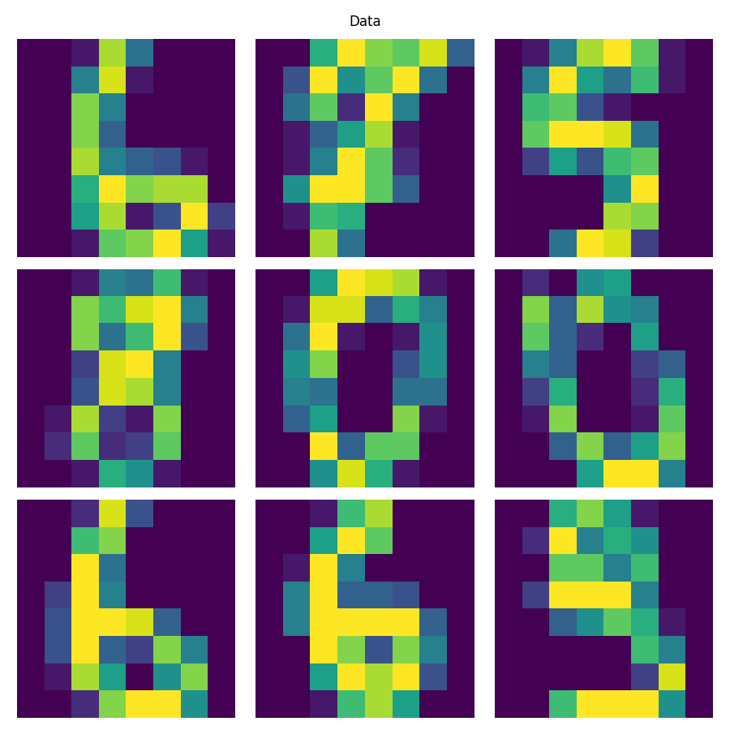
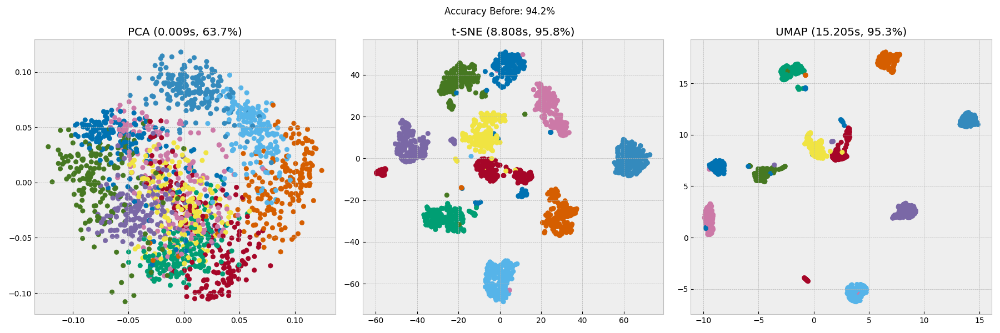

# About The Project
A simple project to compare PCA, t-SNE, and UMAP. Also, a Support Vector Machine (SVM) is used to test out the before and after accuricies of the data.

This was one of the homework questions of EEE-361 "Linear Algebra in Data Analysis and Machine Learning" offered by Bilkent University in 2021-2022 spring semester.

# Requirements
See 'requirements.txt'. 
Python version used: 3.10.3

# Usage
Lines 38-41 can be changed to see how these algoritms performs on any given data. See:

```{python}
# data and labels
digits = load_digits()
data = digits['data']/255
labels = digits['target']
```

# Results
Here are the results for the 'digits' dataset from 'sklearn.datasets'.

Data:


Results:



# Contact
email: kaan.buyukdemirci@ug.bilkent.edu.tr

# Useful Links
- [PCA](https://scikit-learn.org/stable/modules/generated/sklearn.decomposition.PCA.html)
- [t-SNE](https://scikit-learn.org/stable/modules/generated/sklearn.manifold.TSNE.html)
- [UMAP](https://umap-learn.readthedocs.io/en/latest/basic_usage.html)
- [SVM](https://scikit-learn.org/stable/modules/generated/sklearn.svm.SVC.html)

# License
[](https://opensource.org/licenses/MIT)
